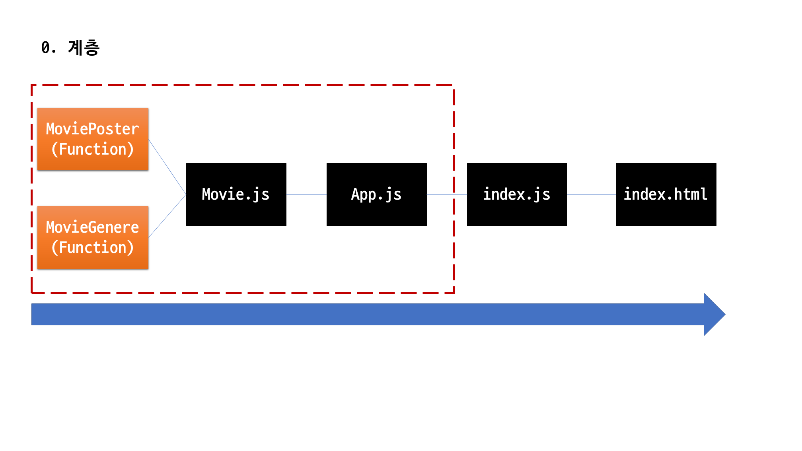
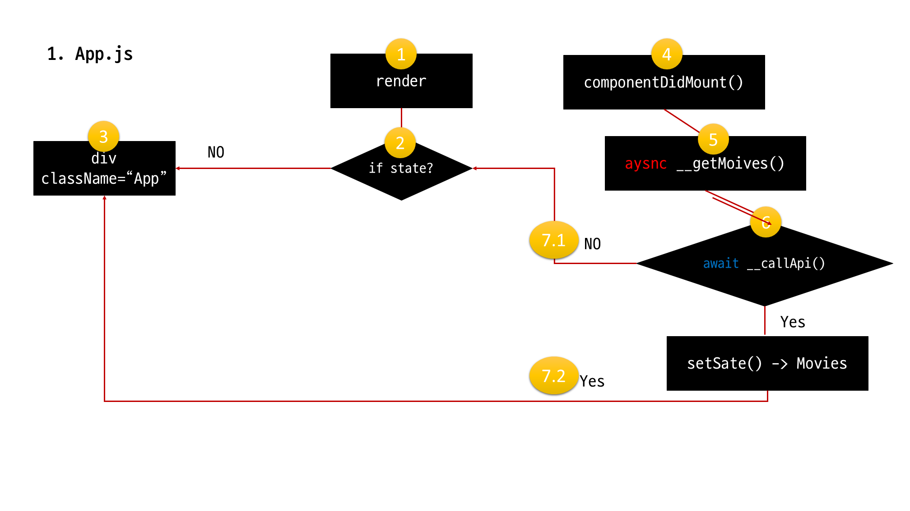
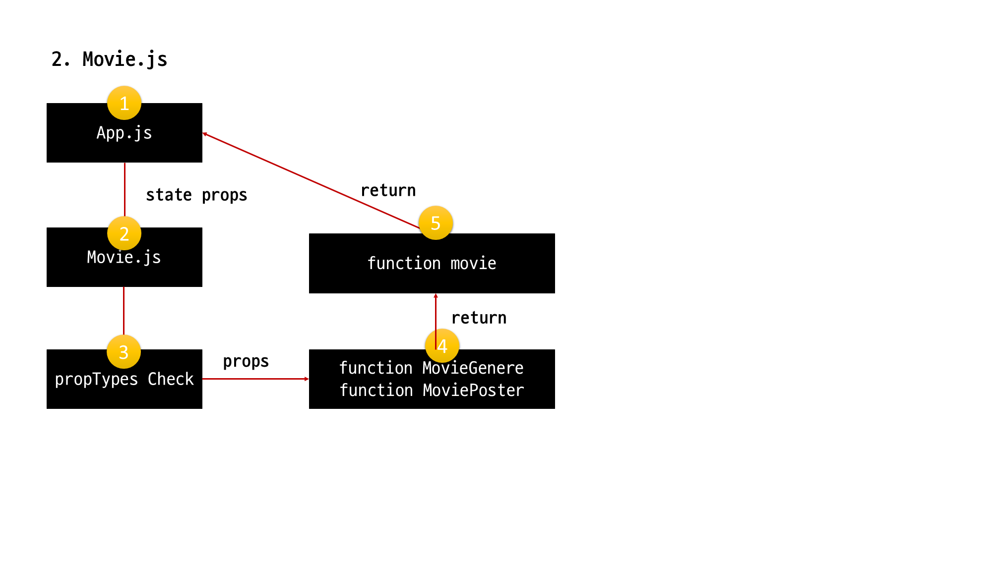

## 작업 요약








## React 구조
- Component -> render() -> return -> html
- JSX : react의 컴포넌트 문법
- React : `UI-library`
- ReactDOM : `웹`에 React 출력
- React-native : `모바일`에 React 출력

## Data Flow
-  `props` : `부모` -> `자식` 데이터 전달
  - 유효성 검사(데이터 타입이 달라도 prop은 됨)
  ```javascript
  import PropTypes from 'prop-types';

  Component.propTypes = {
    title_english: PropTypes.string.isRequired,
    medium_cover_image: PropTypes.string.isRequired,
    genres : PropTypes.array.isRequired,
    synopsis : PropTypes.string.isRequired
  }
  ```
- `state`
  - Component의 `state` 변경 시  `re-render`

## Life Cycle
- 정확하게 공부할 필요가 있다.
- 아직은 `componentDidMount()`는 렌더링 이후 수행, `jQuery`의 ready function

## ES6 내용
-`arrow function`
  - return이 내제되어 있음.
- `map`
  - return이 내제되어 있음

 
  ```javascript
  map((paramters) => { return })
  // no map
  for(i=0; i<movie.length;i++){
    <Movie
      key = {index}
      title_english={movie.title_english}
      medium_cover_image={movie.medium_cover_image}
      genres = {movie.genres}
      synopsis = {movie.synopsis} />
  }

  // map
  this.state.movies.map( (movie, index) =>{
   return <Movie
     key = {index}
     title_english={movie.title_english}
     medium_cover_image={movie.medium_cover_image}
     genres = {movie.genres}
     synopsis = {movie.synopsis} />
   })
   ```


## Ajax
- `fetch`
  - `fetch` 이후의 작업 `.then()`과 에러시 `.catch(e)`로 구분
- 새로고침 필요 없음

## Promise(js Object)
- javscript `비동기` 객체
  - `비동기`
    - DB 2개를 불러오고 싶어, 근데 첫 번째가 너무 긁어오는데 오래걸려
    - 어떻게 해결해? -> `비동기`
- 시나리오를 잡는 방법 제시(통신 여부)
  - response
    - status : 200(True)
    - ok : True of False

## Await & Async
- `promise` 객체를 더욱더 쉽게 표현하는 방법
- `Async`
  - 함수를 `비동기`로 처리하겠다는 뜻
- `await`
  - 함수를 `동기`로 처리하겠다는 뜻
  - 성공 여부를 결정하지 않음
  - API 처리를 불러와서 value를 기다리는 과정(`sync`)
